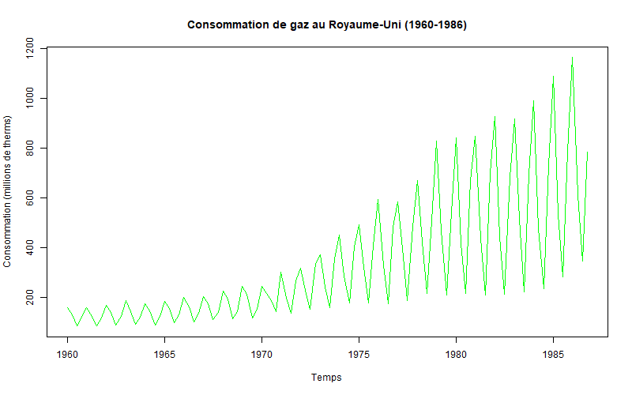
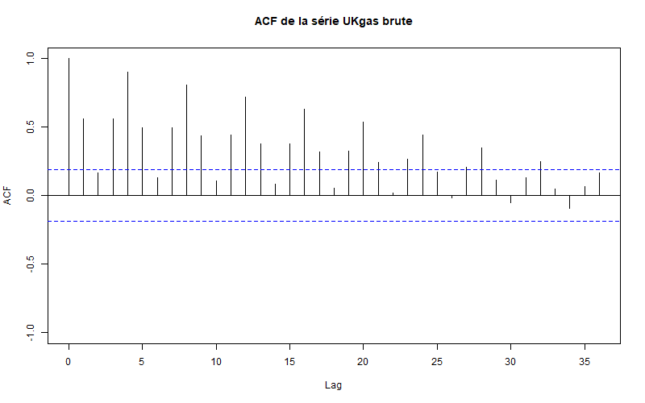
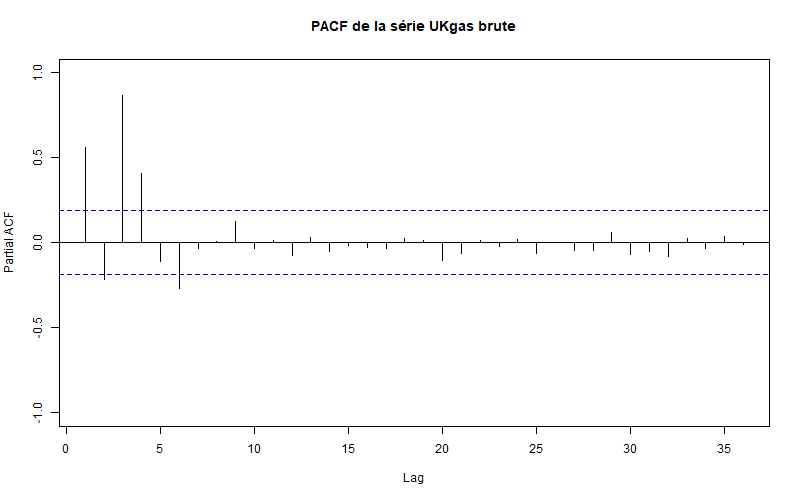
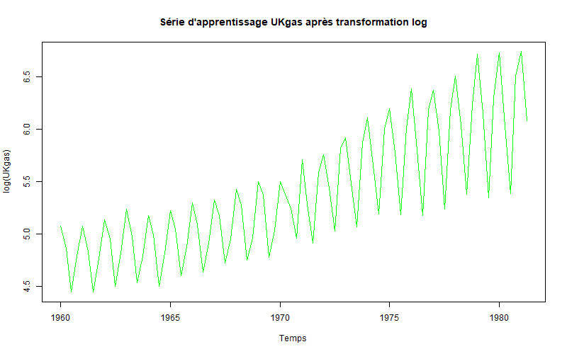
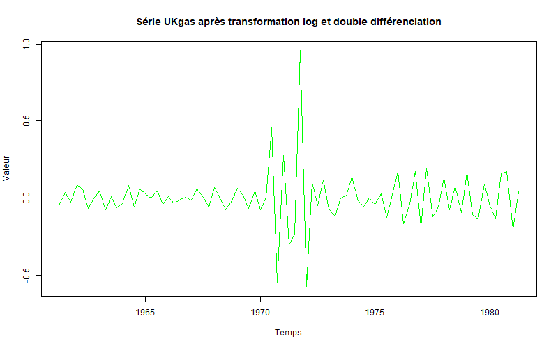
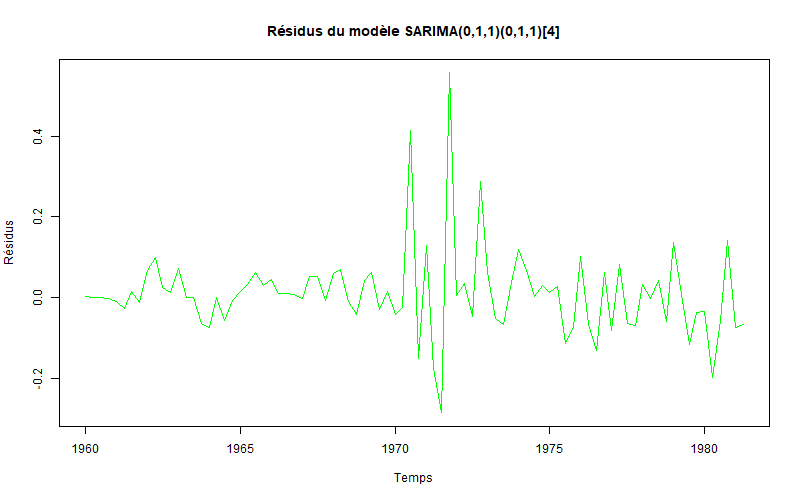
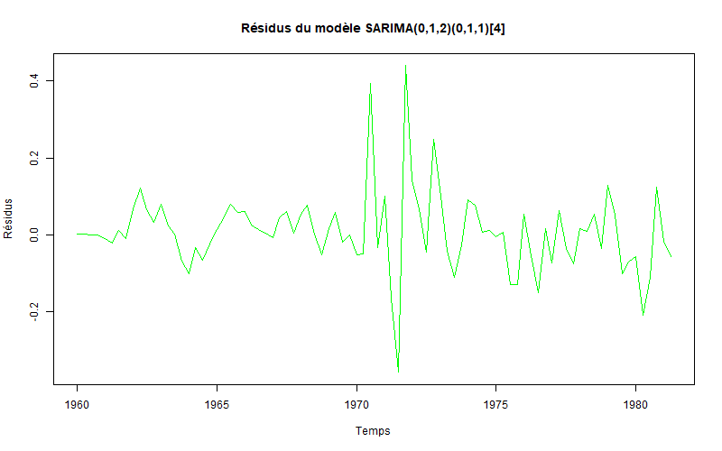
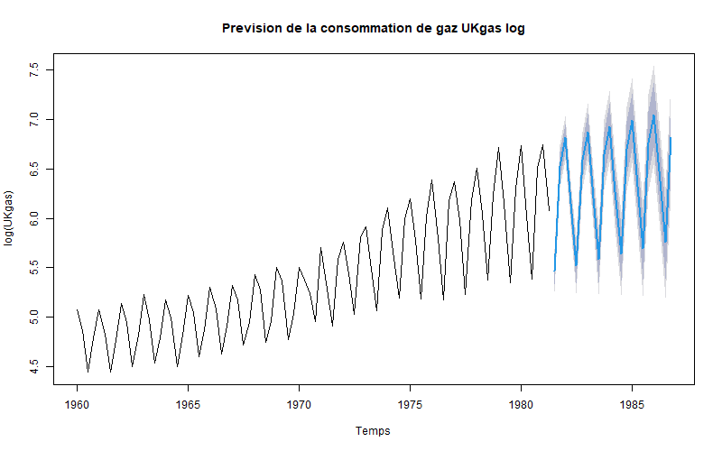
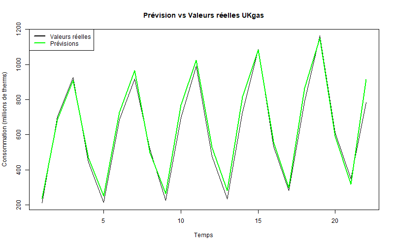

<div align="center">

# 📈 SARIMA UKgas Forecasting

### Time Series Analysis & Forecasting — UK Quarterly Gas Consumption (1960–1986)

**A complete Box-Jenkins methodology pipeline in R: stationarity testing, model identification, estimation, validation, and forecasting on a real seasonal economic time series.**



[](https://www.r-project.org/)
[](https://cran.r-project.org/package=tseries)
[](https://cran.r-project.org/package=forecast)
[](LICENSE)

[Overview](#-overview) •
[Skills Demonstrated](#-skills-demonstrated) •
[Methodology](#-methodology-box-jenkins) •
[Results](#-results) •
[Repository Contents](#-repository-contents)

</div>

---

## 📌 Overview

This project analyzes and forecasts the **UKgas** dataset (UK quarterly natural gas consumption, 1960 Q1 to 1986 Q4 — 108 observations, in millions of therms) using the **Box-Jenkins SARIMA methodology**. The series exhibits a strong upward trend and a marked quarterly seasonality (higher consumption in winter), making it a good candidate for seasonal ARIMA modeling.

The full pipeline — from raw series to validated 22-quarter-ahead forecasts — is implemented in R, with every modeling decision backed by formal statistical tests (Fisher, ADF, KPSS, Ljung-Box, Shapiro-Wilk) rather than visual inspection alone.

> Developed as an academic project at **INSEA** (Institut National de Statistique et d'Économie Appliquée), under the supervision of Mme. Fadoua Badaoui.

---

## 🧠 Skills Demonstrated

| Domain | Applied in this project |
|---|---|
| **Time Series Analysis** | Trend and seasonality detection via ACF/PACF, Fisher tests |
| **Stationarity Testing** | Augmented Dickey-Fuller (ADF) and KPSS tests, log transformation, differencing |
| **Statistical Modeling** | SARIMA(p,d,q)(P,D,Q)[4] model identification, estimation, and comparison |
| **Model Selection** | Student's t-test for coefficient significance, AIC/BIC criteria |
| **Model Validation** | Residual diagnostics: Box-Pierce/Ljung-Box (white noise), Shapiro-Wilk (normality) |
| **Forecasting & Evaluation** | Out-of-sample forecasting (80/20 train-test split), RMSE and MAPE evaluation |
| **Statistical Programming** | R (tseries, forecast, lmtest, randtests), reproducible analysis scripts |

---

## 🔬 Methodology (Box-Jenkins)

The analysis follows the classical Box-Jenkins approach in four stages:

**1. Exploratory analysis** — trend and seasonality identified via ACF/PACF and confirmed with Fisher tests (F = 10.58, p < 0.001 for trend; F = 36.54, p < 0.001 for seasonality)

<table>
<tr>
<td width="50%"></td>
<td width="50%"></td>
</tr>
</table>

**2. Stationarization** — log transformation to stabilize variance, followed by first-order differencing (trend) and seasonal differencing at lag 4 (seasonality)

<table>
<tr>
<td width="50%"></td>
<td width="50%"></td>
</tr>
</table>

Stationarity confirmed by both ADF (p = 0.01) and KPSS (p > 0.1) tests on the transformed series.

**3. Model identification & estimation** — Bartlett's test bounds applied to ACF/PACF of the stationary series to bound candidate orders (p_max=2, q_max=2, P_max=2, Q_max=1). Seven candidate SARIMA models estimated; only those with all coefficients statistically significant (|t| > 1.96) retained.

**4. Validation** — residual diagnostics on the two significant candidates:

<table>
<tr>
<td width="50%"></td>
<td width="50%"></td>
</tr>
</table>

Both models pass the white-noise test (Ljung-Box p > 0.05). **SARIMA(0,1,2)(0,1,1)[4]** selected as the final model based on lowest AIC (−120.64) and BIC (−111.06).

---

## 📊 Results

**5. Forecasting** — the selected model is used to forecast the 22-quarter validation period (1981 Q3 – 1986 Q4):

<table>
<tr>
<td width="50%"></td>
<td width="50%"></td>
</tr>
</table>

| Metric | Value |
|---|---|
| **Model** | SARIMA(0,1,2)(0,1,1)[4] |
| **AIC** | −120.64 |
| **BIC** | −111.06 |
| **RMSE** | 49.55 |
| **MAPE** | 8.20% |

The model captures both the upward trend and the quarterly seasonal pattern with a mean absolute percentage error of 8.2% on unseen data — a strong result for a series with pronounced structural volatility around the 1970s oil shock.

---

## 📁 Repository Contents

```
sarima-ukgas-forecasting/
├── code_UKgas.R          # Full R script — data loading through forecasting
├── ukgas_serie.txt        # UKgas dataset (quarterly, 1960-1986)
├── rapport_SC_final.pdf   # Full written report (French)
├── images/                 # Plots referenced in this README
└── README.md
```

---

## ⚙️ Reproducing the Analysis

### Prerequisites
- R 4.x
- Packages: `tseries`, `zoo`, `forecast`, `lmtest`, `randtests`

### Steps
```r
install.packages(c("tseries", "zoo", "forecast", "lmtest", "randtests"))
source("code_UKgas.R")
```

The script loads the `UKgas` dataset (built into R), runs the full stationarity/identification/estimation/validation/forecasting pipeline, and saves all diagnostic plots as PNG files.

---

## 📄 Full Report

The complete written analysis — including all statistical test outputs, hypothesis formulations, and detailed interpretation — is available in [`rapport_SC_final.pdf`](rapport_SC_final.pdf).

---

## 🎓 Project Context

| | |
|---|---|
| **Authors** | Fatima Ezzahrae Elkhadaouy, Manar Houioua |
| **Supervisor** | Mme. Fadoua Badaoui |
| **Institution** | INSEA — Rabat |
| **Academic Year** | 2025–2026 |

---

## 📄 License

This project is licensed under the MIT License — see the [LICENSE](LICENSE) file for details.

